<!-- ═══════════════════════ HEADER ═══════════════════════ -->

 

<!-- ═══════════════════════ TECH STACK ═══════════════════════ -->
## Tech Stack

**Languages & Frameworks**

  
  
  
  
  
  
  
  
  
  
  

**Tools & Platforms**

  
  
  
  
  
  
  
  
  
  
  

 

<!-- ═══════════════════════ FOOTER ═══════════════════════ -->

